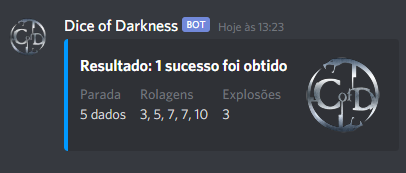

# Dice-of-Darkness
Bot de rolagem de dados para Chronicles of Darkness

Os seguintes comandos são aceitos pelo bot:

!de X -> Rolagem comum onde ocorre explosão do 10, sendo X a quantidade de dados a serem jogados.
!dne X -> X representa a quantidade de dados, contudo não há a explosão do 10.
!ds -> Um dado de sorte é rolado.
!d9 X -> Uma quantidade X de dados é rolada utilizando da explosão do 9.
!d8 X -> Uma quantidade X de dados é rolada utilizando da explosão do 8.

Abaixo um exemplo de como o bot retorna os resultados.

